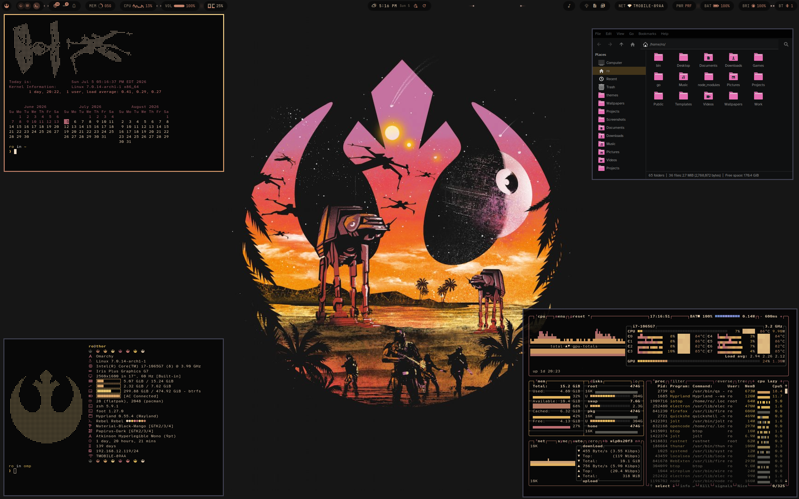

# Rebel, Rebel Theme

An Omarchy Theme for your Arch Linux / Hyprland setup based on Disney/Lucasfilms Star Wars

## Installation

To install this theme, simply use the ``omarchy-theme-install``   

command: `` omarchy-theme-install https://github.com/signaldirective/rebel-rebel ``  

  

**Theme by Signal Directive**
**Additional Credits:** HANCORE for the quickshell theme, you can find it on [HANCORE's github](https://github.com/HANCORE-linux/quickshell-dots) and add the Rebel Alliance glyph yourself in the Theme.qml  

Like my work? Buy me a [coffee!](https://ko-fi.com/signaldirective)
